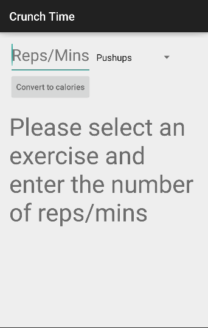
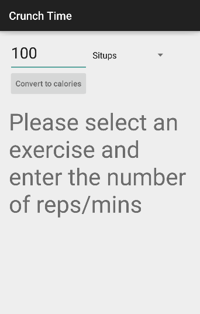
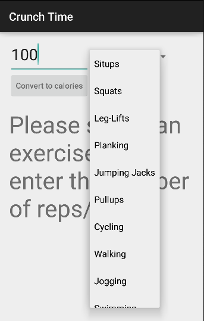
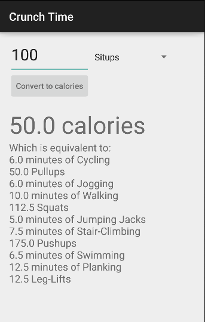

# PROG 01: Crunch Time

This app allows you to enter a number of repetitions/minutes of a given 
exercise from a droplist and then converts that to the number of
calories burned. It will also display the equivalent number of
repetitions/minutes of other exercises from the same dropdownlist
required to burn the same amount of calories.

## Authors

Dake Ying ([dakeying@berkeley.edu](mailto:dakeying@berkeley.edu))

## Demo Video

See [Crunch Time Demo] (https://www.youtube.com/watch?v=PbnjPnlK3es)

## Screenshots

## Acknowledgments

* Hat tip to anyone who's code was used
* Any other support